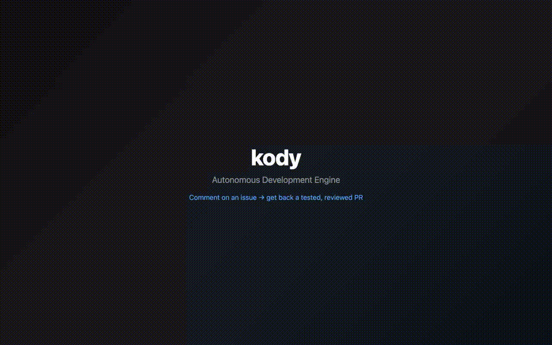

# kody

[](https://www.npmjs.com/package/@kody-ade/kody-engine)
[](https://github.com/aharonyaircohen/kody-engine/actions/workflows/ci.yml)
[](LICENSE)
[](package.json)

**An autonomous development engine that runs in your GitHub Actions.**

Comment `@kody` on an issue and it implements the change, commits, and opens a
PR — all inside CI, no bot server to host. Comment on a PR with explicit
commands such as `@kody resolve` or `@kody sync` for PR maintenance. It's a
single-session Claude Code agent behind a generic executor and declarative JSON
profiles.

```
You:   open an issue → comment "@kody run"
kody:  reads the issue → writes the code → runs your tests → opens a PR
```

<p align="center">
  
</p>

## Why kody

- **No infrastructure.** Runs on the GitHub Actions you already have. One ~20-line
  workflow file, installed via `npx`. Nothing to deploy or keep online.
- **Whole PR lifecycle, not just authoring.** `run`, `resolve`, `sync`, `merge`,
  `revert`, previews, releases, and scheduled agentResponsibilities — one executor, many verbs.
- **Declarative & extensible.** Every command is a folder of `profile.json` +
  `prompt.md` + shell. Add a command by dropping a folder — no engine changes.
- **Bring your own model.** Anthropic native, or any provider via the built-in
  LiteLLM proxy.

## Quickstart

In the repo you want kody to work on:

```bash
npx -y -p @kody-ade/kody-engine@latest kody-engine init
```

Then add **one** repo secret — a model provider key (e.g. `ANTHROPIC_API_KEY`) —
commit the generated `kody.config.json` + `.github/workflows/kody.yml`, and
comment `@kody run` on any issue. That's it. See
[Install in a consumer repo](#install-in-a-consumer-repo) for tokens and
triggers.

## Permissions & safety

kody runs an autonomous agent in your CI with a GitHub token and your model
key. It's built to keep that blast radius small:

- **Least-privilege by default.** Needs `contents` / `pull-requests` / `issues`
  write. A dedicated `KODY_TOKEN` PAT is optional, only for triggering
  downstream CI.
- **Write allowlist.** The agent commits through `commitAndPush`, which blocks
  writes outside an allowlisted set of `.kody/` paths — it can't touch your
  runtime state.
- **Locked-toolbox mode.** A job can declare `tools: [...]` to drop `Bash` and
  shell entirely, running only a fixed set of high-level intents.
- **Review like any contributor.** kody opens PRs; you merge them.

See [SECURITY.md](SECURITY.md) to report a vulnerability.

## Architecture

```
┌─────────────────────────────────────────────┐
│ Consumer repo workflow (.github/kody.yml)  │  @kody comments · schedule · manual dispatch
└─────────────────────────────────────────────┘
                    ↓
┌─────────────────────────────────────────────┐
│ kody-engine CLI (@kody-ade/kody-engine)    │
│   bin/kody.ts — entrypoint                  │
│   src/dispatch.ts — agentResponsibility-driven routing     │
│   src/executor.ts — runs agentResponsibility implementations│
│   .kody/agent-responsibilities/<slug>/                      │
│     profile.json · agent-responsibility.md                  │
│   src/agent-actions/<name>/                   │
│     profile.json · prompt.md · *.sh         │
│   src/scripts/*.ts — cross-cutting catalog  │
└─────────────────────────────────────────────┘
```

Every top-level command is an auto-discovered agentResponsibility action. The router has **zero agentAction names hardcoded** — comment dispatch resolves the first token after `@kody` through `config.aliases`, then falls back to the legacy-named `config.defaultAgentAction` / `config.defaultPrAgentAction` fields as default agentResponsibility actions. Drop a new `.kody/agent-responsibilities/<slug>/` directory with `profile.json` + `agent-responsibility.md`; that agentResponsibility chooses its implementation agentAction.

AgentAction directories are private implementation units and contain **only** three kinds of files: `profile.json` (declaration), `prompt.md` (agent instructions), and `.sh` scripts (mechanical side-effect work). Cross-cutting TypeScript lives in [src/scripts/](src/scripts/); it can't import from `src/agent-actions/` and can't branch on `profile.name`.

## Install in a consumer repo

```bash
npx -y -p @kody-ade/kody-engine@latest kody-engine init
```

`kody-engine init` scaffolds [kody.config.json](kody.config.schema.json), `.github/workflows/kody.yml` (generated from `WORKFLOW_TEMPLATE` in [src/scripts/initFlow.ts](src/scripts/initFlow.ts)), and per-scheduled-agentResponsibility workflow files. Idempotent — pass `--force` to overwrite.

Required repo secrets: at least one model provider key (e.g. `MINIMAX_API_KEY`, `ANTHROPIC_API_KEY`). Recommended: `KODY_TOKEN` PAT so kody's commits trigger downstream CI and can modify `.github/workflows/*`.

The consumer workflow listens on `issue_comment` for `@kody ...` dispatch and `workflow_dispatch` for manual runs, chat mode, and scheduled wakeups.

## Commands

```
# The published bin is `kody-engine` (renamed from `kody` in v0.4.77 to avoid
# shadowing a consumer repo's own `kody` bin). Install globally or via `npx`.

# issue authoring
kody-engine run               --issue <N>                     # implement an issue end-to-end

# PR operations
kody-engine resolve           --pr <N> [--prefer ours|theirs] # merge default branch, resolve conflicts
kody-engine sync              --pr <N>                         # merge default into a PR branch
kody-engine merge             --pr <N>                         # merge a green PR
kody-engine revert            --pr <N> --shas <sha...>         # mechanically revert PR commits
kody-engine preview-build     --pr <N>                         # build and publish a PR preview

# release operations
kody-engine release           --issue <N> [--bump patch|minor|major] [--dry-run]
kody-engine release-prepare   --issue <N> [--bump patch|minor|major] [--dry-run]
kody-engine release-publish   --issue <N> [--dry-run]
kody-engine release-deploy    --issue <N> [--dry-run]
kody-engine npm-publish       [--tag latest] [--access public] [--dry-run]

# scheduled agentResponsibilities and goals
kody-engine agent-responsibility-scheduler                                    # fan out due .kody/agent-responsibilities/<slug>/ folders
kody-engine agent-responsibility-tick          --agentResponsibility <slug> [--force]        # one agent tick for one agentResponsibility
kody-engine agent-responsibility-tick-scripted --agentResponsibility <slug> [--force]        # one deterministic tickScript agentResponsibility tick
kody-engine goal-scheduler                                    # fan out active .kody/goals/instances/* state files
kody-engine goal-manager      --goal <id>                     # advance one managed goal instance

# setup, servers, and utilities
kody-engine init              [--force]                       # scaffold consumer repo
kody-engine ci                                                # auto-dispatch from the GitHub Actions event
kody-engine chat              [--session <id>]                # dashboard-driven chat session
kody-engine serve                                             # LiteLLM/editor helper
kody-engine brain-serve                                       # Brain SSE server
kody-engine pool-serve                                        # warm-pool owner
kody-engine runner-serve                                      # warm-pool one-shot runner
kody-engine agent-ask        --agent <slug> --message "..." # ad-hoc agent run
kody-engine stats                                             # inspect run/event history
```

### AgentResponsibilities

A **agentResponsibility** is a folder at `.kody/agent-responsibilities/<slug>/` with `profile.json` metadata (`every`, `agent`, `action`, `agentAction`, `stage`, and related fields) plus human-owned prose in `agent-responsibility.md`. `agent-responsibility-scheduler` wakes on cron, finds due agentResponsibilities, and dispatches either `agent-responsibility-tick` for an agent tick or `agent-responsibility-tick-scripted` for a deterministic `tickScript` agentResponsibility. `kody-engine init` copies built-in starter agentResponsibilities and scaffolds `.kody/agents/kody.md`.

Locked-toolbox agentResponsibilities can declare `"tools": [...]` in `profile.json` to run with only the named high-level MCP intents plus `submit_state`; agentResponsibilities without `tools` keep the legacy Bash/gh toolbox.

### `release`

`release` is a single deterministic flow: bump version files, update `CHANGELOG.md`, open or reuse a release PR, wait for CI, merge, publish, deploy, and notify. `release-prepare`, `release-publish`, and `release-deploy` remain available as explicit stage commands.

## Profiles

A profile is declarative JSON + an adjacent `prompt.md`. See any directory under [src/agent-actions/](src/agent-actions/) for examples. Adding a new command = new directory + profile + prompt + any `.sh` scripts + registering any new shared TS utilities under [src/scripts/](src/scripts/). No executor, entry, or dispatch changes.

See [AGENTS.md](AGENTS.md) for the full architectural contract.

## Contributing

Contributions are welcome. See [CONTRIBUTING.md](CONTRIBUTING.md) for the dev
loop and the invariants to respect, and [AGENTS.md](AGENTS.md) for the deep
architecture. By participating you agree to the
[Code of Conduct](CODE_OF_CONDUCT.md).

## License

[MIT](LICENSE) © Aharon Yair Cohen
